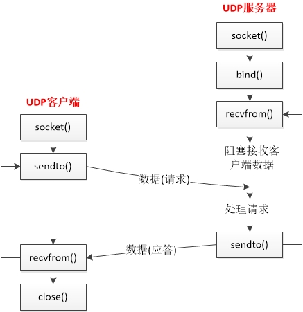

# 第八章 基本UDP套接字编程

[TOC]


## 一：结构




## 二：recvfrom 和 sendto

```c++
#include <sys/socket.h>

ssize_t recvfrom(int sockfd, void *buff, size_t nbytes, int flags,
	struct sockaddr *from, socklen_t *addrlen);
ssize_t sendto(int sockfd, const void *buff, size_t nbytes, int flags,
	const struct sockaddr *to, socklen_t addrlen);
```


