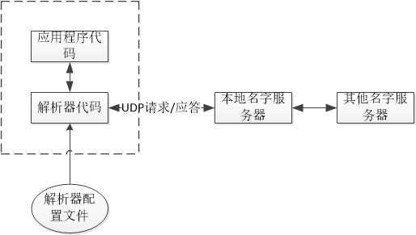
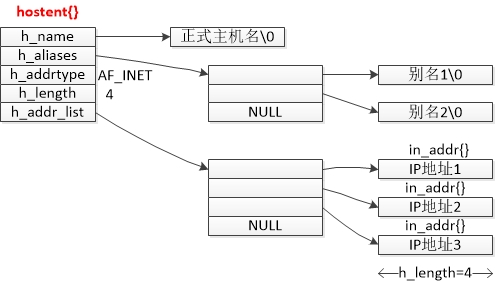

# 第十一章 名字与地址转换

[TOC]


## 一：域名系统

域名系统（DNS）主要用于主机名称与IP地址之间的映射。DNS中的条目称为资源记录：

- A
- AAAA
- PTR
- MX
- CNAME




## 二：DNS函数

### 2.1 gethostbyname

```c++
#include <netdb.h>

struct hostent *gethostbyname(const char *hostname); // 成功返回非空指针，失败NULL且设置h_errno

struct hostent {
	char *h_name;		// official name of host
  	char **h_aliases;	// alias names
  	int h_addrtype;		// host address type: AF_INET
  	int h_length;		// length of address:4
  	char **h_addr_list;	// ptr to array of ptrs with IPv4 addrs
};
```

`gethostbyname` 由主机名得到主机信息，记录在 `hostent` 结构体中：



### 2.2 gethostbyaddr

```c++
#include <netdb.h>

struct hostent *gethostbyaddr(const char *addr, socklen_t len, int family);
```

`gethostbyaddr` 试图由一个二进制的IP地址找到相应的主机名，与 `gethostbyname` 的行为刚好相反。

addr参数实际上不是char *类型指针，而是一个指向存放IPv4地址的某个in_addr结构的指针；len参数是这个结构体的大小：Ipv4地址为4；family参数为AF_INET。

### 2.3 getservbyname 和 getservbyport

```c++
#include <netdb.h>

struct servent *getservbyname(const char *servname, const char *protoname);
struct servent *getservbyport(int port, const char *protoname);

struct servent {
	char *s_name;		// official service name
  	char **s_aliases;	// alias list
  	int s_port;			// port number, network byte order
  	char *s_proto;		// protocol to use
};
```

通过service名称或者端口号获得服务地址。

### 2.4 getaddrinfo

上述函数仅支持IPv4，`getaddrinfo` 支持IPv4和IPv6。

```c++
#include <netdb.h>

int getaddrinfo(const char *hostname, const char *service,
	const struct addrinfo *hints, struct addrinfo **result); // 成功返回0，否则非0
void freeaddrinfo(struct addrinfo *ai);
const char *gai_strerror(int error);

struct addrinfo {
	int ai_flags;
  	int ai_family;
  	int ai_socktype;
  	int ai_protocol;
  	socklen_t ai_addrlen;
  	char *ai_canonname;
  	struct sockaddr *ai_addr;
  	struct addrinfo *ai_next;
};
```

`gai_strerror` 将 `getaddrinfo` 的错误返回值转化为字符串，取值如下：

| 常值           | 说明                       |
| ------------ | ------------------------ |
| EAI_AGAIN    | 名字解析中临时失败                |
| EAI_BADFLAGS | ai_flags的值无效             |
| EAI_FAIL     | 名字解析中不可恢复的失败             |
| EAI_FAMILY   | 不支持ai_family             |
| EAI_MEMORY   | 内存分配失败                   |
| EAI_NONAME   | hostname或service未提供或者不可知 |
| EAI_OVERFLOW | 用户参数缓冲区溢出                |
| EAI_SERVICE  | 不支持ai_socktype类型的service |
| EAI_SOCKTYPE | 不支持ai_socktype           |
| EAI_SYSTEM   | 在errno变量中有系统错误返回         |

