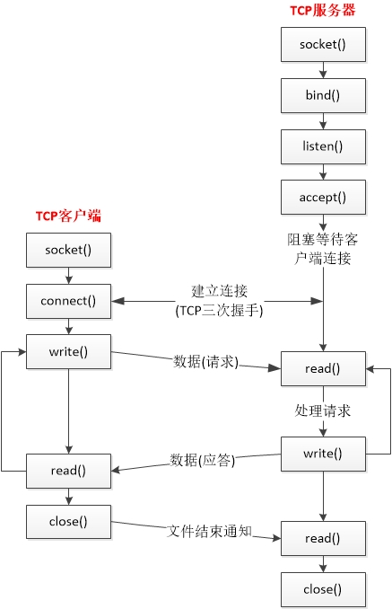

# 第四章 基本TCP套接字编程

[TOC]


## 一：结构




## 二：套接字函数

### 2.1 socket

```c++
#include <sys/socket.h>

int socket(int family, int type, int protocol);	// 成功返回非负描述符，出错返回-1
```

| family   | 说明      |
| -------- | ------- |
| AF_INET  | IPv4协议  |
| AF_INET6 | IPv6协议  |
| AF_LOCAL | Unix域协议 |
| AF_ROUTE | 路由套接字   |
| AF_KEY   | 密钥套接字   |

| type           | 说明      |
| -------------- | ------- |
| SOCK_STREAM    | 字节流套接字  |
| SOCK_DGRAM     | 数据报套接字  |
| SOCK_SEQPACKET | 有序分组套接字 |
| SOCK_RAW       | 原始套接字   |

| protocol     | 说明       |
| ------------ | -------- |
| IPPROTO_TCP  | TCP传输协议  |
| IPPROTO_UDP  | UDP传输协议  |
| IPPROTO_SCTP | SCTP传输协议 |

| type\family    | AF_INET   | AF_INET6  | AF_LOCAL | AF_ROUTE | AF_KEY |
| -------------- | --------- | --------- | -------- | -------- | ------ |
| SOCK_STREAM    | TCP\|SCTP | TCP\|SCTP | 是        |          |        |
| SOCK_DGRAM     | UDP       | UDP       | 是        |          |        |
| SOCK_SEQPACKET | SCTP      | SCTP      | 是        |          |        |
| SOCK_RAW       | IPv4      | IPv6      |          | 是        | 是      |

TCP是一个字节流协议，仅支持 `SOCK_STREAM` 套接字。`protocol` 一般为0，由系统选择恰当的协议类型。

### 2.2 connect

```c++
#include <sys/socket.h>

int connect(int sockfd, const struct sockaddr *servaddr, socklen_t addrlen); // 成功返回0，出错-1
```

connect出错情况：

- TCP客户端没有收到服务器的SYNC分节响应，返回 `ETIMEDOUT`；
- TCP服务端没有相应服务返回 `ECONNREFUSED` 硬错误；
- 路由器目标不可达，返回 `EHOSTUNREA` 或 `ENETUNREACH` 软错误。

### 2.3 bind

```c++
#include <sys/socket.h>

int bind(int sockfd, const struct sickaddr *myaddr, socklen_t addrlen); // 成功返回0，错误返回-1
```

通配地址的指定：

```c++
struct sockaddr_in servaddr;
servaddr.sin_addr.s_addr = htonl(INADDR_ANY); // wildcard

struct sockaddr_in6 serv;
serv.sin6_addr = in6addr_any; // wildcard
```

### 2.4 listen

```c++
#include <sys/socket.h>

int listen(int sockfd, int backlog);
```

当socket函数创建一个套接字时，他被假设为一个主动的套接字；listen 函数把一个未连接的套接字转化成一个被动套接字。其中，**未完成队列** 和 **已完成队列** 之和不超过 `backlog`。

### 2.5 accept

```c++
#include <sys/socket.h>

int accept(int sockfd, struct sockaddr *cliaddr, socklen_t *addrlen);
```

服务器监听客户端连接，注意accept的阻塞操作。

### 2.6 close

```c++
#include <unistd.h>

int close(int sockfd);
```


